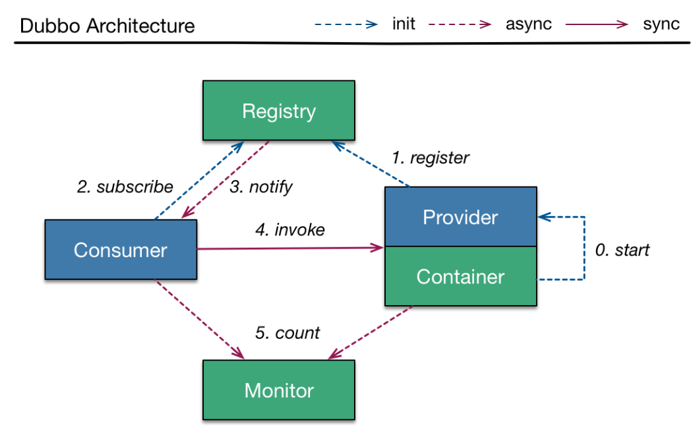

# Dubbo

> 参照Dubbo官方文档

### 基础



### 依赖

```xml
<!-- springboot 一套引入 -->
<dependency>
    <groupId>com.alibaba.boot</groupId>
    <artifactId>dubbo-spring-boot-starter</artifactId>
    <version>0.2.0</version>
</dependency>
<!-- 单独引入 -->
<dependency>
    <groupId>com.alibaba</groupId>
    <artifactId>dubbo</artifactId>
    <version>2.6.5</version>
</dependency>
<dependency>
    <groupId>com.101tec</groupId>
    <artifactId>zkclient</artifactId>
    <version>0.10</version>
    <exclusions>
        <exclusion>
            <groupId>log4j</groupId>
            <artifactId>log4j</artifactId>
        </exclusion>
        <exclusion>
            <groupId>org.slf4j</groupId>
            <artifactId>slf4j-log4j12</artifactId>
        </exclusion>
    </exclusions>
</dependency>
```


### 协议

#### dubbo://

Dubbo 缺省协议采用**单一长连接**和 NIO 异步通讯，**适合于小数据量**大并发的服务调用，以及服务消费者机器数远大于服务提供者机器数的情况。 

反之，Dubbo 缺省协议不适合传送大数据量的服务，比如传文件，传视频等，除非请求量很低。

**特性**

- 连接个数：单连接
- 连接方式：长连接
- 传输协议：TCP
- 传输方式：NIO 异步传输
- 序列化：Hessian 二进制序列化
- 适用范围：传入传出参数数据包较小（建议小于100K），消费者比提供者个数多，单一消费者无法压满提供者，尽量不要用 dubbo 协议传输大文件或超大字符串。
- 适用场景：常规远程服务方法调用

**约束**

- 参数及返回值需实现 `Serializable` 接口
- 参数及返回值不能自定义实现 `List`, `Map`, `Number`, `Date`, `Calendar` 等接口，只能用 JDK 自带的实现，因为 hessian 会做特殊处理，自定义实现类中的属性值都会丢失。

数据通信：A->B

1. 类A比类B多一种属性：不抛异常，多的那个属性B接收不到。
2. 枚举A多一种枚举，使用多出来的枚举传输：抛异常；不使用：不抛异常，B正常接收
3. A和B的属性名相同，但是类型不同：抛异常

dubbo可以配置多端口、多连接(缺省每服务每提供者每消费者使用单一长连接)

#### rmi://

RMI 协议采用 JDK 标准的 `java.rmi.*` 实现，采用阻塞式短连接和 JDK 标准序列化方式。 

**特性**

- 连接个数：多连接
- 连接方式：短连接
- 传输协议：TCP
- 传输方式：同步传输
- 序列化：Java 标准二进制序列化
- 适用范围：传入传出参数数据包大小混合，消费者与提供者个数差不多，可传文件。
- 适用场景：常规远程服务方法调用，与原生RMI服务互操作

**约束**

- 参数及返回值需实现 `Serializable` 接口
- dubbo 配置中的超时时间对 RMI 无效，需使用 java 启动参数设置：`-Dsun.rmi.transport.tcp.responseTimeout=3000`

### 配置

dubbo的配置方式主要有以下几种：XML配置、属性配置、API配置、注解配置。

#### XML配置

provider.xml示例

```xml
<beans xmlns:xsi="http://www.w3.org/2001/XMLSchema-instance"
       xmlns:dubbo="http://dubbo.apache.org/schema/dubbo"
       xmlns="http://www.springframework.org/schema/beans"
       xsi:schemaLocation="http://www.springframework.org/schema/beans http://www.springframework.org/schema/beans/spring-beans.xsd
       http://dubbo.apache.org/schema/dubbo http://dubbo.apache.org/schema/dubbo/dubbo.xsd">
    <!--应用名-->
    <dubbo:application name="demo-provider"/>
    <!--注册中心地址-->
    <dubbo:registry address="zookeeper://127.0.0.1:2181"/>
    <!--采用的协议和端口号，多个提供者的话要改端口号-->
    <dubbo:protocol name="dubbo" port="20890"/>
    <!--接口实现类，可以用注解@Servcie代替-->
    <bean id="providerServiceImpl" class="com.ddh.learn.providerdemo.service.ProviderServiceImpl"/>
    <!--指定提供服务的接口，可以用注解@Service代替，其中的属性也可以在注解中配置，但是没有XML细-->
    <dubbo:service interface="com.ddh.learn.api.service.ProviderService" ref="providerServiceImpl"/>
</beans>
```

consumer.xml示例

```xml
<beans xmlns:xsi="http://www.w3.org/2001/XMLSchema-instance"
       xmlns:dubbo="http://dubbo.apache.org/schema/dubbo"
       xmlns="http://www.springframework.org/schema/beans"
       xsi:schemaLocation="http://www.springframework.org/schema/beans http://www.springframework.org/schema/beans/spring-beans.xsd
       http://dubbo.apache.org/schema/dubbo http://dubbo.apache.org/schema/dubbo/dubbo.xsd">
    <dubbo:application name="demo-consumer"/>
    <dubbo:registry group="aaa" address="zookeeper://127.0.0.1:2181"/>
    <!--指定引用服务-->
    <dubbo:reference id="providerService" check="false" interface="com.ddh.learn.api.service.ProviderService"/>
</beans>
```


**配置之间的关系**

> 各个XML标签都对应着API接口


| 接口              | 标签                   | 用途         | 解释                                                         |
| ----------------- | ---------------------- | ------------ | ------------------------------------------------------------ |
| ServiceConfig     | `<dubbo:service/>`     | 服务配置     | 用于暴露一个服务，定义服务的元信息，一个服务可以用多个协议暴露，一个服务也可以注册到多个注册中心 |
| ReferenceConfig   | `<dubbo:reference/>`   | 引用配置     | 用于创建一个远程服务代理，一个引用可以指向多个注册中心       |
| ProtocolConfig    | `<dubbo:protocol/>`    | 协议配置     | 用于配置提供服务的协议信息，协议由提供方指定，消费方被动接受。如果需要支持多协议，可以声明多个标签并在中通过protocol属性指定使用的协议 |
| ApplicationConfig | `<dubbo:application/>` | 应用配置     | 用于配置当前应用信息，不管该应用是提供者还是消费者           |
|                   | `<dubbo:module/>`      | 模块配置     | 用于配置当前模块信息，可选                                   |
| RegistryConfig    | `<dubbo:registry/>`    | 注册中心配置 | 用于配置连接注册中心相关信息                                 |
| MonitorConfig     | `<dubbo:monitor/>`     | 监控中心配置 | 用于配置连接监控中心相关信息，可选                           |
| ProviderConfig    | `<dubbo:provider/>`    | 提供方配置   | 当 ProtocolConfig 和 ServiceConfig 某属性没有配置时，采用此缺省值，可选 |
| ConsumerConfig    | `<dubbo:consumer/>`    | 消费方配置   | 当 ReferenceConfig 某属性没有配置时，采用此缺省值，可选      |
| MethodConfig      | `<dubbo:method/>`      | 方法配置     | 用于 ServiceConfig 和 ReferenceConfig 指定方法级的配置信息   |
| ArgumentConfig    | `<dubbo:argument/>`    | 参数配置     | 用于指定方法参数配置                                         |

**配置文件的优先级**

如果在多处同时配置了同一种属性，例如timeout，则判定如下：

* 方法级别>接口级别>全局配置
* 在级别相同的前提下，则消费方的配置>提供方


#### 注解配置

采用注解配置相对更简便些，服务提供方暴露服务只需在类上添加注解`@Service`，但要注意是dubbo包下的。同时在properties配置文件中配置应用名称、注册中心地址、协议名称、协议端口等等。最后指定Spring扫描路径。

服务消费方则需要使用`@Reference` 来注入服务提供方的实例。在properties中配置好应用名称、注册中心地址、超时时间等等，指定Spring扫描路径，即可远程调用服务。

注解配置方式虽然简便但是功能不如XML配置来的全面，例如无法进行方法级别的一些配置。所以平时可以使用XML配置与注解配置相结合的方式。最后在启动类上引入XML的配置文件即可。

```java
@ImportResource({"classpath:config/spring-dubbo-consumer.xml"})
```

#### 属性配置

如果在xml配置中有超过一个的tag，那么你可以使用‘id’进行区分。如果你不指定id，它将作用于所有tag。

- `dubbo.protocol.rmi.port=1099` 相当于 ` <dubbo:protocol id="rmi" name="rmi" port="1099" /> `
- `dubbo.registry.china.address=10.20.153.10:9090` 相当于 ` <dubbo:registry id="china" address="10.20.153.10:9090" /> `

1：如果在classpath下有超过一个dubbo.properties文件，比如，两个jar包都各自包含了dubbo.properties，dubbo将随机选择一个加载，并且打印错误日志。

2：如果 `id`没有在`protocol`中配置，将使用`name`作为默认属性。

配置文件的覆盖：

* JVM System Properties，-D参数
* Externalized Configuration，外部化配置
* ServiceConfig、ReferenceConfig等编程接口采集的配置(API、XML)，`XML的标签、注解之间如果重复好像会选择之前生效的那一个？还需了解配置文件的加载流程`。
* 本地配置文件dubbo.properties

[操作细节](./操作细节.md)

### 注册中心

#### zookeeper


流程说明：

- 服务提供者启动时: 向 `/dubbo/com.foo.BarService/providers` 目录下写入自己的 URL 地址
- 服务消费者启动时: 订阅 `/dubbo/com.foo.BarService/providers` 目录下的提供者 URL 地址。并向 `/dubbo/com.foo.BarService/consumers` 目录下写入自己的 URL 地址
- 监控中心启动时: 订阅 `/dubbo/com.foo.BarService` 目录下的所有提供者和消费者 URL 地址。

注意：

- 服务提供者启动时: 向 `/dubbo/com.foo.BarService/providers` 目录下写入自己的 URL 地址
- 服务消费者启动时: 订阅 `/dubbo/com.foo.BarService/providers` 目录下的提供者 URL 地址。并向 `/dubbo/com.foo.BarService/consumers` 目录下写入自己的 URL 地址
- 监控中心启动时: 订阅 `/dubbo/com.foo.BarService` 目录下的所有提供者和消费者 URL 地址。

### 元数据中心(zookeeper)

dubbo的provider和consumer有很多的配置项都只是自己使用的，不需要进入注册中心，相互传递。这些配置项和元数据(服务接口，接口的方法信息)都需要被存储下来，保存到独立的key-value存储库中。provider存储内容都通过gson化后进行存储。

**在配置中心配置**

```properties
dubbo.registry.address=zookeeper://127.0.0.1:2181
### 注意驼峰式风格
dubbo.metadata-report.address=zookeeper://127.0.0.1:2181 ###元数据存储的地址
```

这里使用zookeeper作为配置中心，元数据地址和注册中心地址相同，启动zookeeper之后运行ZKTools就可以写入

```properties
###dubbo.properties
dubbo.config-center.address=zookeeper://127.0.0.1:2181
```

完成上面两步后，注册中心地址和元数据地址将从配置中心获取。

**配置在项目中-properties方式引入配置**


### 推荐用法

在Provider端尽量多配置Consumer端属性，建议在Provider端配置的Consumer端的实行有：

1. `timeout`：方法调用的超时时间
2. `retries`：失败重试次数，缺省是 2
3. `loadbalance`：负载均衡算法，缺省是随机 `random`。还可以配置轮询 `roundrobin`、最不活跃优先`leastactive` 和一致性哈希 `consistenthash` 等
4. `actives`：消费者端的最大并发调用限制，即当 Consumer 对一个服务的并发调用到上限后，新调用会阻塞直到超时，在方法上配置 `dubbo:method` 则针对该方法进行并发限制，在接口上配置 `dubbo:service`，则针对该服务进行并发限制

建议在Provider端配置的Provider的属性有：

1. `threads`：服务线程池大小
2. `executes`：一个服务提供者并行执行请求上限，即当 Provider 对一个服务的并发调用达到上限后，新调用会阻塞，此时 Consumer 可能会超时。在方法上配置 `dubbo:method` 则针对该方法进行并发限制，在接口上配置 `dubbo:service`，则针对该服务进行并发限制

配置管理信息、配置Dubbo缓存文件( 该文件会缓存注册中心列表和服务提供者列表。配置缓存文件后，应用重启过程中，若注册中心不可用，应用会从该缓存文件读取服务提供者列表，进一步保证应用可靠性)、配置监控中心、推荐使用XML配置。