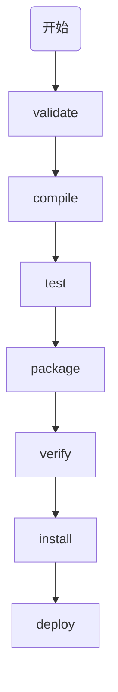
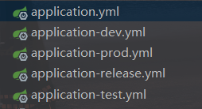

# maven

## 要点

* project：顶级节点
* modelVersion：指的是此POM使用的对象模型的版本，很少更改，除非必要
* groupId：组id
* artifactId：工作id
* version：版本，通常带有`-SNAPSHOT`，该值是指最新的但不稳定开发版本。发行版本不带后缀
* name：名称，在maven的生成文档中会用到
* url：指哪里找到项目的站点，在maven的生成文档中经常使用
* properties：用于指定版本，在POM中任何位置都可以访问
* dependency：依赖
* build：处理目录结构，插件管理等

## 生命周期

maven内部的三个构建生命周期，分别是`default`、`clean`、`site`项目文档创建

其中default生命周期的**核心阶段**如下：



* `validate`：验证项目是否正确以及是否有所有必要的信息
* `compile`：编译项目的源代码
* `test`：用合适的单元测试框架测试编译后的源码
* `package`：获取编译后的代码，并将其打包为可分发的格式，如JAR
* `verify`：对测试结果进行检测，以符合标准
* `install`：将软件包安装到本地maven仓库中，可以作为本地项目的依赖项
* `deploy`：将软件包复制到远程仓库中，与他人共享

### 命令行调用

```powershell
mvn verify # maven将会先执行default中verify之前的生命周期，再到verify
mvn clean deploy # maven将会先执行clean的生命周期，再执行default的生命周期从开始到deploy
```

maven的生命周期的功能的实现则是由插件来完成，一个插件可以支持多种功能也称之为目标，例如：compiler 插件有两个目标：compile 和 testCompile，分别实现编译源代码 和 编译测试代码。生命周期的每个阶段可以有多个插件，每个插件可以有多个目标。

### 项目构建生命周期

#### 打包

打包有多种格式jar、war、ear、pom，默认为jar。下面是打包类型为jar时，生命周期阶段(phase)和插件(plugn)目标(goal)的映射关系。

| Phase(阶段)              | plugin(插件):goal(目标)   |
| :----------------------- | :------------------------ |
| `process-resources`      | `resources:resources`     |
| `compile`                | `compiler:compile`        |
| `process-test-resources` | `resources:testResources` |
| `test-compile`           | `compiler:testCompile`    |
| `test`                   | `surefire:test`           |
| `package`                | `jar:jar`                 |
| `install`                | `install:install`         |
| `deploy`                 | `deploy:deploy`           |

若是pom打包方式只将目标绑定到`install`和`deploy`阶段。

可以为某个阶段添加目标，例如：

```xml
<!-- 再process-test-resources阶段添加display:time目标是time，输出时间 -->
...
 <plugin>
   <groupId>com.mycompany.example</groupId>
   <artifactId>display-maven-plugin</artifactId>
   <version>1.0</version>
   <executions>
     <execution>
       <phase>process-test-resources</phase>
       <goals>
         <goal>time</goal>
       </goals>
     </execution>
   </executions>
 </plugin>
...
```

下面是maven三个内置生命周期的详细阶段，以及内置生命周期的绑定。

[详细的生命周期及绑定]( http://maven.apache.org/guides/introduction/introduction-to-the-lifecycle.html#Lifecycle_Reference )

## POM

### 项目继承

如果希望groupId或者模块的版本号和父模块相同，只要删掉就行，子模块会继承父模块的groupId和版本号。

### 目录结构

父模块`pom.xml`和子模块的`pom.xml`的关系连接，可以通过`<relativePath>`指定父模块`pom.xml`的路径，默认值为`../pom.xml`。

### 项目聚合

```
 |-- my-module
 |   `-- pom.xml
 `-- parent
     `-- pom.xml
```

指定pom文件路径，my-module继承parent

```xml
<!-- parent -->
<project>
  <modelVersion>4.0.0</modelVersion>
 
  <groupId>com.mycompany.app</groupId>
  <artifactId>my-app</artifactId>
  <version>1</version>
  <packaging>pom</packaging>
 
  <modules>
    <module>../my-module</module>
  </modules>
</project>

<!-- my-module -->
<project>
  <modelVersion>4.0.0</modelVersion>
 
  <parent>
    <groupId>com.mycompany.app</groupId>
    <artifactId>my-app</artifactId>
    <version>1</version>
    <relativePath>../parent/pom.xml</relativePath>
  </parent>
 
  <artifactId>my-module</artifactId>
</project>
```

### 项目的变量

可以直接拿节点的值作为变量使用，例如：`${project.version}`

特殊变量

| `project.basedir`       | 当前项目所在的目录。                                |
| ----------------------- | --------------------------------------------------- |
| `project.baseUri`       | 当前项目所在的目录，以URI表示。*从Maven 2.1.0开始*  |
| `maven.build.timestamp` | 表示构建开始（UTC）的时间戳。*从Maven 2.1.0-M1开始* |

时间格式可以定制

```xml
<project>
  ...
  <properties>
    <maven.build.timestamp.format>yyyy-MM-dd'T'HH:mm:ss'Z'</maven.build.timestamp.format>
  </properties>
  ...
</project>
```

## 构建配置文件

### profile

开发中面对不同的环境，可能有不同的配置，profile可以定义一系列的配置信息，指定其激活条件。profile可以定义在项目的pom.xml文件中，也可以在setting.xml中。

```xml
<profiles>
    <profile>
        <!-- 本地开发环境 -->
        <id>dev</id>
        <properties>
            <profiles.active>dev</profiles.active>
        </properties>
        <activation>
            <!-- 设置默认激活这个配置 -->
            <activeByDefault>true</activeByDefault>
        </activation>
    </profile>
    <profile>
        <!-- 发布环境 -->
        <id>release</id>
        <properties>
            <profiles.active>release</profiles.active>
        </properties>
    </profile>
    <profile>
        <!-- 测试环境 -->
        <id>test</id>
        <properties>
            <profiles.active>test</profiles.active>
        </properties>
    </profile>
</profiles>
```

这里定义了三个环境的配置，dev、release、test。在不指定的情况下默认是dev，因为有`<activation>`。

在主配置文件中配置如下，让其更具需求自由切换环境配置

```xml
# application.yml
spring:
  profiles:
    active: @profile.active@ #此处由maven的环境选择决定
```

选择具体使用的配置文件



1. 可以通过mvn命令参数来指定选择哪个配置文件生效，通过-P参数。

```powershell
# 前面的test为生命周期阶段，第二个test则是构建配置文件的指定id参数，也可以为dev、release
mvn test -Ptest
```

2. 可以在setting.xml中设置，添加`<activeProfiles>`属性

```xml
<settings xmlns="http://maven.apache.org/POM/4.0.0"
   xmlns:xsi="http://www.w3.org/2001/XMLSchema-instance"
   xsi:schemaLocation="http://maven.apache.org/POM/4.0.0
   http://maven.apache.org/xsd/settings-1.0.0.xsd">
   ...
   <activeProfiles>
      <activeProfile>test</activeProfile>
   </activeProfiles>
</settings>
```

执行命令

```powershell
# 这个test只是生命周期阶段，不用再传入-Ptest参数了，因为在setting.xml中指定了
mvn test
```

3. 通过环境变量激活配置文件

在pom.xml里<id>为test的<profile>节点，加入<activation>节点：

```xml
<profile>
    <id>test</id>
    <activation>
        <property>
            <name>env</name>
            <value>test</value>
        </property>
    </activation>
</profile>
```

执行命令

```powershell
# env指得就是name，test就是value
mvn test -Denv=test
```

4. 通过操作系统激活
5. 通过文件的存在或缺失来激活配置文件

```xml
<profile>
   <id>test</id>
   <activation>
      <file>
         <missing>target/generated-sources/axistools/wsdl2java/
         com/companyname/group</missing>
      </file>
   </activation>
</profile>
```

当该路径文件缺失时，该profile将被激活。

## 依赖

依赖关系中，如果出现多版本，可以采取"就近原则"，就是说在依赖关系树中选择与你项目最接近的依赖关系的版本。如果两个依赖版本在依赖关系树中的深度相同，则第一个声明的获胜。

### 依赖范围 scope

依赖关系范围用于限制依赖关系的可传递性。`scope`有以下几种范围：

* compile：编译依赖范围，在编译、测试、运行时都要使用该依赖的jar包，这些依赖项还会传播到相关项目。
* provider：编译和测试有用，运行无效。比如servlet-api，在项目运行时，tomcat容器已经提供了，不需要再重复引入，**不可传递**。
* runtime：测试和运行有效，编译无效。例如jdbc驱动实现，编译时只要接口，测试或运行时才需要具体的jdbc驱动实现。
* test：仅在测试时有效，**不可传递**
* system：通过systemPath元素显示指定依赖文件的路径，不会再maven仓库中找，可移植性低。
* import：在指定的`<dependencyManagement>`中导入依赖，只能在`<dependencyManagement>`中使用。

**依赖导入 import**

版本管理通常都在父模块pom文件的`<dependencyManagement>`中指定版本号，然后再在子模块中直接引入即可。但是依赖太多十分杂乱，可以把dependencyManagement放到分类放到单独的pom中，然后再在需要使用依赖的模块中通过scope import来导入。

### 可选依赖 optional

A：

```xml
<dependencies>
    <dependency>
        <groupId>joda-time</groupId>
        <artifactId>joda-time</artifactId>
        <version>2.9.9</version>
        <optional>true</optional>
    </dependency>
</dependencies>
```

B：

```xml
<parent>
    <groupId>A</groupId>
    <artifactId>A</artifactId>
    <version>1.0-SNAPSHOT</version>
</parent>

<dependencies>
    <dependency>
        <groupId>joda-time</groupId>
        <artifactId>joda-time</artifactId>
    </dependency>
</dependencies>
```

B依赖A，A中的joda-time的optional设置为true，此时A可以正常引入该依赖，但是B无法引入该依赖。要想正常引入需要将optional设置为false，或者在B中显示地引入，如上所示。