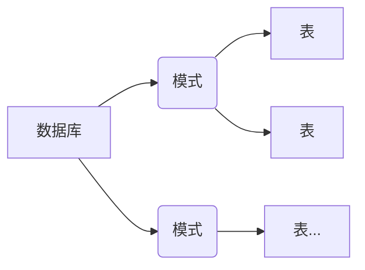

# postgresql

>  PostGreSQL是一个功能强大的开源对象关系数据库管理系统(ORDBMS)，号称**世界上最先进的开源关系型数据库**。经过长达15年以上的积极开发和不断改进，PostGreSQL已在可靠性、稳定性、数据一致性等获得了很大的提升。
> 对比时下最流行的 MySQL 来说，PostGreSQL 拥有更灵活，更高度兼容标准的一些特性。
> 此外，PostGreSQL基于MIT开源协议，其开放性极高，这也是其成为各个云计算大T 主要的RDS数据库的根本原因。 

### 常用终端命令

* 登录，-U 用户名

```shell
psql -h 127.0.0.1 -p 5432 -d database -U postgres
\q  断开连接
```

* 展示数据库

```shell
\l	展示所有数据库
\l '*post*'  展示名称里包含post字符串的数据库
```

* 切换数据库

```shell
\c dbname
```

* 展示表

```shell
\d  展示所有表
\d "tablename" 展示指定表的信息（表结构）
```

* 模式(schema)

```shell
show search_path  # 展示当前模式
set search_path to myschema  # 切换模式
```

### 结构



**模式的优势**

- 允许多个用户使用一个数据库并且不会互相干扰。
- 将数据库对象组织成逻辑组以便更容易管理。
- 第三方应用的对象可以放在独立的模式中，这样它们就不会与其他对象的名称发生冲突。

建表时如果不指定模式，则使用默认的public模式

```sql
create table myschema.company(
	ID  INT NOT NULL
);
select * from myschema.company;
```

### 备份还原

```shell
# 备份，-u用户，-d要备份的数据库名，-f输出文件
pg_dump -U postgres -d dbname -f dump.sql
# 还原，-d 要还原的数据库名
psql -U postgres -d backup -f dump.sql
```

### postgresql整合springboot jpa

通过jpa对pg数据库进行一些简单的操作

1. 引入依赖

```xml
<dependency>
    <groupId>org.springframework.boot</groupId>
    <artifactId>spring-boot-starter-data-jpa</artifactId>
</dependency>
<dependency>
    <groupId>org.postgresql</groupId>
    <artifactId>postgresql</artifactId>
    <scope>runtime</scope>
</dependency>
```

2. 配置数据源等信息

```yml
spring:
  datasource:
    username: postgres
    password: 123456
    url: jdbc:postgresql://127.0.0.1:5432/demo
  jpa:
    hibernate:
      ddl-auto: update  # 自动创建和更新表结构
```

3. 创建实体类

```java
@Data
@Builder
@AllArgsConstructor
@NoArgsConstructor
@Entity
@EntityListeners(AuditingEntityListener.class)
@Table(name = "tb_author")
public class Author{
    @Id
    @GeneratedValue(strategy = GenerationType.IDENTITY)
    private Long id;

    private String name;

    private String hometown;

    @CreatedDate
    private Date createTime;

    @LastModifiedDate
    private Date updateTime;
}

@Data
@Builder
@AllArgsConstructor
@NoArgsConstructor
@Entity
@EntityListeners(AuditingEntityListener.class)
@Table(name = "tb_book")
public class Book {

    @Id
    @GeneratedValue(strategy = GenerationType.IDENTITY)
    private Long id;

    private String type;

    private String title;

    @Column(columnDefinition = "text")
    private String description;

    /**
     * 收藏数
     */
    @Column(name = "fav_count")
    private Integer favCount;

    @ManyToOne(fetch = FetchType.LAZY, optional = false)
    @JoinColumn(name = "author_id", nullable = false)
    private Author author;

    @CreatedDate
    private Date createTime;

    @LastModifiedDate
    private Date updateTime;
}
```

* `@CreateDate`和`@LastModifiedDate`会自动补上创建时间和更新时间。需要配合`@EntityListeners(AuditingEntityListener.class)`使用，另外还需要在启动类上加上`@EnableJpaAuditing`注解。
* `@ManyToOne`描述了多对一的关系
* `JoinColumn`指定其关联的外键

4. 创建Repository、Service层

```java
public Book createBook(BookDTO bookDTO) {
        Book build = Book.builder().title(bookDTO.getTitle())
                .description(bookDTO.getDescription())
                .favCount(bookDTO.getFavCount())
                .author(bookDTO.getAuthor())
                .type(bookDTO.getType()).build();
        return bookRepository.save(build);
    }

public Boolean updateBook(BookDTO bookDTO) {
    Book bookDb = getBook(bookDTO.getId());
    if (bookDb.getId() != null) {
        bookDb.setTitle(bookDTO.getTitle() == null ? bookDb.getTitle() : bookDTO.getTitle());
        bookDb.setType(bookDTO.getType() == null ? bookDb.getType() : bookDTO.getType());
        bookDb.setDescription(bookDTO.getDescription() == null ? bookDb.getDescription() : bookDTO.getDescription());
        bookDb.setFavCount(bookDTO.getFavCount() == null ? bookDb.getFavCount() : bookDTO.getFavCount());
        bookDb.setAuthor(bookDTO.getAuthor() == null ? bookDb.getAuthor() : bookDTO.getAuthor());
        return bookRepository.save(bookDb) != null;
    }
    return false;
}

public Book getBook(Long id) {
    if (id == null) {
        return null;
    }
    return bookRepository.findById(id).orElse(null);
}

public void deleteBook(Long id) {
    if (id == null) {
        return;
    }
    bookRepository.deleteById(id);
}
```

最后测试成功。

还可以使用`JpaSpecificationExecutor`实现动态查询，首先数据层要继承该接口，然后再逻辑层使用

```java
/**
 * 动态查询，模糊查询和查找大于fav的交集，排序
 * gt大于、lt小于、ge大于等于、le效于等于
 *
 * @param title 关键字
 * @param fav   收藏数
 * @return 结果匹配的集合
 */
public List<Book> findByConditions(String title, Integer fav) {
    Sort sort = Sort.by(Sort.Direction.ASC, "id");
    return bookRepository.findAll((Specification<Book>) (root, criteriaQuery, criteriaBuilder) -> {
        List<Predicate> predicateList = new ArrayList<>();
        // 模糊查询
        if (title != null) {
            predicateList.add(criteriaBuilder.like(root.get("title"), "%" + title + "%"));
        }
        // 查找大于fav的
        if (fav != null) {
            predicateList.add(criteriaBuilder.gt(root.get("favCount"), fav));
        }
        // 结果取交集
        return criteriaBuilder.and(predicateList.toArray(new Predicate[0]));
    }, sort);
}
```

具体的`JpaSpecificationExecutor`操作可以参考[jpa](./jpa.md)

