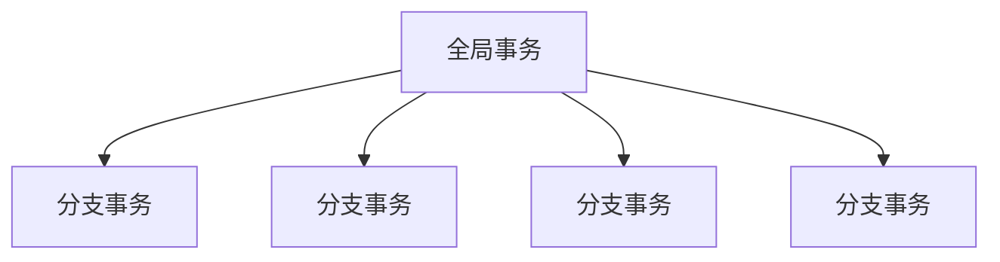

# Seata 分布式事务

## 基础概念

### 事务

事务指的就是一个操作单元，在这个操作单元中的所有操作最终要保持一致的行为，要么所有操作都成功，要么所有的操作都被撤销。简单地说，事务提供一种“要么什么都不做，要么做全套”机制。

### 本地事务

可以认为是数据库提供的事务机制，数据库会将此次事务涉及到到的所有操作全部纳入一个不可分割的执行单元，该执行单元中的所有操作要么都成功，要么都失败，只要有一步操作失败，就全部回滚。

### 分布式事务

指事务的参与者的服务器、资源服务器、事务管理器在不同的分布式节点上，说白了，分布式事务就是保证不同数据库的数据一致性。

### 术语

* TC (Transaction Coordinator) - 事务协调者：维护全局和分支事务的状态，驱动全局事务提交或回滚。

* TM (Transaction Manager) - 事务管理器：定义全局事务的范围：开始全局事务、提交或回滚全局事务。

* RM (Resource Manager) - 资源管理器(数据库)：管理分支事务处理的资源，与TC交谈以注册分支事务和报告分支事务的状态，并驱动分支事务提交或回滚。

Seata的执行流程：

1. A服务的TM向TC申请开启一个全局事务，TC就会创建一个全局事务并返回一个唯一的XID 
2. A服务的RM向TC注册分支事务，并及其纳入XID对应全局事务的管辖 
3. A服务执行分支事务，向数据库做操作 
4. A服务开始远程调用B服务，此时XID会在微服务的调用链上传播 
5. B服务的RM向TC注册分支事务，并将其纳入XID对应的全局事务的管辖 
6. B服务执行分支事务，向数据库做操作 
7. 全局事务调用链处理完毕，TM根据有无异常向TC发起全局事务的提交或者回滚 
8. TC协调其管辖之下的所有分支事务， 决定是否回滚 

> 看完Seata的执行流程，再回去看TC、TM、RM的定义就很明了了

